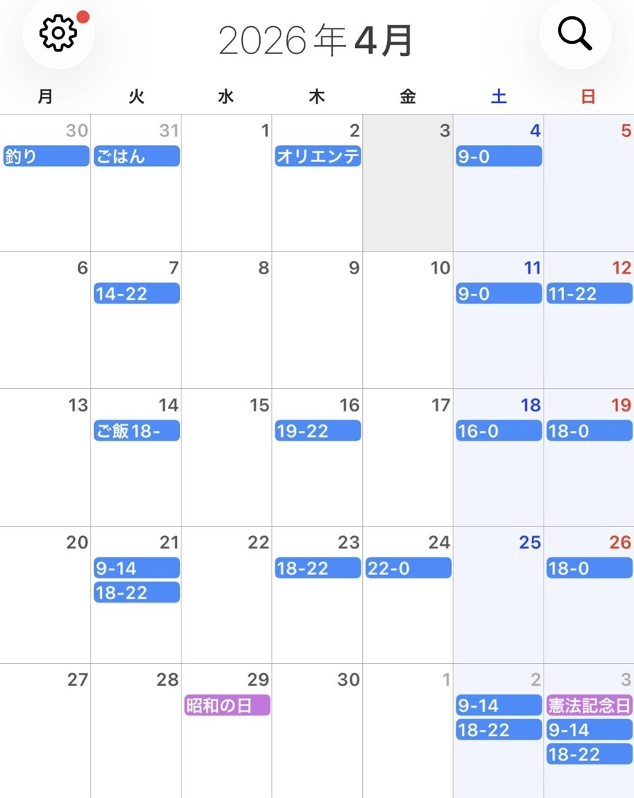
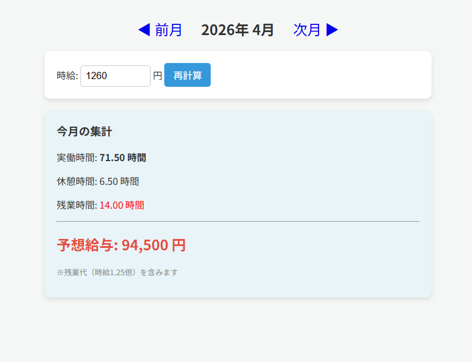

# Salary Calculator

Googleカレンダーに登録されたシフト予定から、勤務時間と推定給与を自動計算するWebアプリです。

以下のURLからすぐに実際のアプリをお試しいただけます。

## アプリを使ってみる 

**[アプリを開く](https://my-salary-app-fur7.onrender.com)**

### ログイン時のご注意
本アプリは個人のカレンダーを読み取るため、Googleの公式審査を受ける前の状態となっています。

ログインできないため下記の画像をご覧ください

---

## アプリのイメージ

4/2のオリエンテーション、4/14のご飯18-　などフォーマット外の文字は自動的に計算から除外されます。

---

## カレンダーへの入力フォーマット

本アプリは、Googleカレンダーの**予定のタイトル**から時間を読み取ります。
正しく計算させるために、以下の形式で入力してください。

| 入力例 | 意味 | 計算される勤務時間 |
| :--- | :--- | :--- |
| `14-22` | 14:00 〜 22:00 | 8時間 |
| `18〜2` | 18:00 〜 翌2:00 | 8時間 (日またぎ対応) |
| `9.5-17.5` | 9:30 〜 17:30 | 8時間 (小数対応) |
| `10~15` | 10:00 〜 15:00 | 5時間 |

### 入力のルール
- **半角数字**を使用してください。
- 開始時間と終了時間を記号（ `-` または `〜` または `~` ）で繋いでください。
- タイトルに「時」や「休憩」などの文字を入れると読み取れません（数字と記号のみにしてください）。
- 終了時間が開始時間より小さい場合、自動的に「翌日の時間」として計算します。
- 15分毎の時間に対応しています。( 9:00 → 9 , 9:15 → 9.25 , 9:30 → 9.5 , 9:45 → 9.75 )

## 開発の背景
毎月シフト管理アプリに入力するのが非常に手間だと感じていました。

そこで、「自分が普段使っているGoogleカレンダーに予定を入れるだけで、自動的に給料が計算されるツールがあれば便利だ」と考え、本アプリの開発に至りました。

## 工夫したポイント
- **文字列解析**: カレンダーの予定名に「14-0」「18〜22」など、記号や文字が混ざっていても、正規表現を用いて正確に勤務時間を抽出するロジックを実装しました。
- **日またぎ勤務への対応**: 終了時間が開始時間を下回る場合（例：14時〜翌0時）、自動的に「+24時間」して計算処理を破綻させない仕組みを構築しました。
- **セキュアな認証と環境変数**: Google APIのクライアントIDやシークレットキーはソースコードに直書きせず、環境変数として切り出すことでセキュリティを担保しています。

---

## 主な機能
- **Google OAuth 2.0 ログイン**: ユーザーのGoogleアカウントで安全に認証します。
- **シフト自動解析**: カレンダーの予定名から勤務時間を自動計算します。
- **給与計算ロジック**: 
  - 法定労働時間に基づく**休憩時間の自動控除**（6時間以上で45分、8時間以上で1時間など）。
  - 実働8時間を超えた場合の**残業代（25%割増）の自動計算**。
- **カレンダー月切り替え**: 「前月」「次月」ボタンで、過去の稼働実績や未来の給与予定をスムーズに確認できます。
- **時給の動的シミュレーション**: 画面上で時給を変更し、リアルタイムに給与を再計算できます。

## 今後の展望
- [ ] 交通費の自動計算機能の追加
- [ ] 複数バイトの掛け持ちへの対応

## 使用技術
- **バックエンド**: Java 17, Spring Boot 3.2.4
- **フロントエンド**: HTML/CSS, Thymeleaf
- **認証 & API**: Spring Security (OAuth 2.0 Client), Google Calendar API v3
- **デプロイ環境**: Render

---
